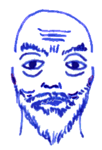

## Asphyx

The grand master of the aerial lodge up on *Mount Snoskrida* is a
thin, bald man with a white beard. If you cannot at least *levitate*,
you do not gain access to his remote fortress. It is said, that
intrepid mountaineers have tried climbing all the way up, but if any
ever succeeded, they don't seem to have left any traces.

They say that he spent twelve years in a jinn palace on *Vanaheim*,
learning all their secrets and spells.

### Treasure

The *hawthorn ring* turns you and everyone you touch into an
intertwined group of bushes until dusk or dawn. He likes to use this
when he's away from his aerial lodge and needs some quality quiet
time.

### The Book of the Mountain Witch

**Bird friendship** (1) allows you to talk with all birds for a day.

**Eagle eyes** (1) allows you to see through the eyes of any bird you
can see, for 20min. Simply look up at the sky, focus onto a bird and
see what it sees.

**Feather fall** (1) allows you to fall any distance without taking
any falling damage. This spell can be cast at any time, so as long as
you are conscious, not gagged, and have at least one free hand
available, you can cast it before hitting the ground.

**Illusion** (2) allows you to create and maintain an illusion as
large as a house for as long as you concentrate on it. Anybody
touching it may save vs. spells in order to see through the illusion.
An illusion attacks like the caster but always has an AC of 9.
Illusionary damage affects you as long as you believe it until you
faint.

**Invisibility** (2) allows you to turn invisible until you attack a
living creature. The spell can be reversed: an *invisibility purge*
dispels all invisibilities within 60ft. Ethereal creatures or people
shadow walking are not affected. The purge lingers for 10 minutes.

**Levitation** (2) allows you to defy gravity for 20min. Jump up and
keep floating up, climb up vertical cliff faces effortlessly, but
beware the end of the spell: you take the usual 1d6 per 10ft falling
damage if you're afloat.

**Flying** (3) allows you to fly at half you movement speed (like a
person wearing plate armour) for 2h. When the spell ends and you are
still flying, you fall and take the usual 1d6 per 10ft falling damage

**Gaseous form** (3) makes you malleable and gas-like so that you may
pass through anything that is not airtight. It also makes you
invulnerable to non-magical weapons. You may creep along the floor
like a dying man on his hands and knees, or you may rise up into the
air like smoke to be blown wherever the winds will blow.

**Lightning bolt** (3) strikes any visible foe within 200ft and
everybody standing between you and them, unless they're very small or
lying on the ground. Anything within two feet of the bolt is affected
and takes 1d6 damage per caster level (5d6 minimum), save vs. spells
for half damage.

**Like grass** (4) allows you to ignore all bludgeoning damage and
falling damage. If you're hit by clubs, hammers, maces, wrecking
balls, rocks, or whatever else, you are simply flung aside and tumble
and roll like a superhero, undamaged.

**Slipstream travel** (4) turns you and anybody else within 10ft into
a magical dust that can follow any living thing as it moves through
air or water for as long as you want. Usually, this is used to
transport a group of people using birds.

**Whirlwind** (4) transform you into a little whirlwind, destroying
wooden structures and dealing 2d6 to anybody in melee with you. Any
enemy taking damage must save vs. death or be flung back for a few
yards.

**Airstrike** (5) gives you and anybody else within 10ft the ability
to run through the air for 20min as if running on an invisible path
created just for you.

**Creation** (5) is like making a *wish*: use it to create or destroy
inanimate matter as big as a ship. This takes 10min to cast. The
creation is powered by elemental air. Using it to generate a ship of
gold will work but it attracts other elemental creatures trying to
right the imbalance: Jinn, Afarit, Ghouls or Marid, for example.
