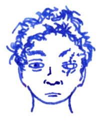

## Beryl

The owner of black castle Amberyl in the *Black Mountains* is an old sorceress named Beryl. A permanent darkness covers this castle and the surrounding cliffs and crags. Approaching the castle itself is difficult without the permanent light spells.

Her castle is guarded by seven bronze golems:
HD 10 AC 0 3d10 MV 12 ML 12 XP 1000. In addition to that, the giant owls of *Mount Irach* act as her spies and occasional she will ride one of them to visit other magic users: HD 5 AC 6 1d4/1d4/2d8 F5 MV 24 ML 6 XP 500.

The floor inside her castle is either covered in sand, pebbles, straw, carpets, or made of wood, stone, copper, and so on. Walking in any room makes a distinct sound which Beryl is able to pick up with her *spider senses*. Any shouting and  banging hurts her and she hates that. This is why there is a big sign at the entrance: Tread softly!

They say Beryl lost one of her eyes when she attained the rank of Odin's chosen one. There is always an intelligent raven close to her. She will sometimes use such ravens to send messages or to spy on visitors.

### Treasure

The *scroll of nevermore* looks like an completely ordinary scroll with the word "Nevermore" written at the top but it is otherwise empty. This scroll can be used to curse any entity, organization or area, regardless of size, if one writes a poem that describes the destruction of this area or entity vividly, using the word "nevermore" as rhyme pattern.

### The Book of Darkness

**Darkness** (1) with a radius of 60ft and a duration of 2h; anybody within it is blind (-4 to hit). Victims get a save vs. spells.

**Detect magic** (1) is always useful. 60ft range. The blue magic glow highlighting all enchantments is visible to all.

**Charm person** (1) affects a single target, save vs. spells to resist. To break free, victims save again every day if their intelligence is 13 or better, every week if their intelligence is average, or every month if their intelligence is 8 or lower. While charmed, victims will treat you as their best friend. Once victims break free, they will remember everything they did and if they did anything they would not have ordinarily have done, they will react with shame and anger. Charms usually cause severe emotional distress!

**Permanent darkness** (2) with a radius of 60ft; anybody within it is blind (-4 to hit, no targeting of spells). If you target somebody directly, the must save vs. spells or be blinded.

**Spider senses** (2) allows you to hear the smallest vibrations within 300ft for a day. Within this range, you hear anybody walking and overhear any conversation. At the same time, More than ten people moving or talking within range will confuse you and any shouting or banging will hurt.

**Loud whispers** (2) enchants an area as big as a castle for a day such that whenever you whisper within the enchanted area, your whispers carry everywhere.

**Artifical life** (3) animates any kind of material and imbues it with a life of its own. You need a handful of gems and crystals to bind the magical energies. The value of these gems makes no difference: spending 5000gp instead of 100gp just creates a better looking golem. The HD of such a golem is limited by the material used and it is limited to its creator's level minus one. Such a creature needs no rest, no food, no water and no friends. It does not sicken nor will it ever die unless destroyed by violence. Golems do not speak and are a bit dim. They don't use interesting tactics, they can't cast spells and they don't use ranged weapons, but they will defend their creator at all costs, taking any blows aimed at them, if possible. Sadly, while most are loyal servants they still take a retainer slot. If their creator has more retainers than allowed by their charisma, the golems may malfunction and gain independence.

**Shadow blast** (3) opens a rift to the plane of shadows and from it pours a fetid wind of some strange substance that grows cobwebs and shrouds as it blows, and anybody caught in it must save vs. spells or be blinded, deafened and stunned for a minute. An area about 20ft wide and 300ft long will be caught in this storm. To be stunned means that you cannot move and you cannot attack, but opponents must still roll to hit.

**Scrying** (3) is the art of seeing far away places in the flames and smoke of a big fire. Stare into the flames for ten minutes, open your third eye, send your spirit to far away places and report what you see. You can only see what your eyes could see if you where there. No other sense is available to you. You must know the location or the person you want to see. If you are looking for a known person, the target gets a save vs. spells to avoid being scryed upon. Either way, they feel watched.

**Curse** (4) affects a visible target within hearing distance, or anybody who's hair you have in your fingers, unless they save vs. spells. Curses include love (intelligence 3), weakness (strength 3), trembling (dexterity 3), sickness (constitution 3), shape changing (turn into an animal during either day or night), bad luck (-4 to all saves), and the like. This spell can be reversed to break an existing curse.

**Shadow walking** (4) is the art of opening a passage to the plane of shadows, a place where an endless labyrinth of ruins open to a dim grey sky above and a liquid darkness suffocates any travelers. Every hour spent on this plane costs a point of strength, but if you know where you want to go, every hour travelled here will take you a hundred miles in the real world. You and your companions will emerge in a dark and murky place near your target destination. You may take as many people with you as will come but any whose loyalty is not certain must make a morale check or refuse. Strength lost recovers at the rate of 1/day.

**Telekinesis** (4) gives you power over matter and gravity: fling rocks around, tear up the ground, rip open windows, crush everything. A volume of matter as big as cart (up to 20 humans) can be moved and thrown up to 200ft. When targets are hit by flying debris, or when targets are flung into solid objects, they will take 1d6 damage per caster level (i.e. at least 7d6), save vs. spells for half. If dropping rocks on a target from high above, the usual 1d6 damage per 10ft applies (i.e. at most 20d6), save vs. spells for half. When living things smash into other living things, damage is split between the two (e.g. 20 humans dropping on a group of 20 humans from 200ft means 40 humans take 10d6 damage, save vs. spells for half).

**Possession** (5) allows you to transfer your soul into a gem and from there you make take possession of victims within 120ft.  They must save vs. spells or their soul exchanges places with your soul: they end up imprisoned in the gem and you end up in control of their body, keeping your intelligence, wisdom, charisma, level, class and alignment but getting the new host's strength, dexterity, constitution, hit points and all their abilities except for their spell casting abilities. If the gem remains within 120ft, killing the host will simply force your souls to switch places again, so their soul dies with their body where as you are back in the gem, ready to possess another body.

**Gaseous Form** (5) allows you to move with 20ft/rd through the smallest cracks for as long as you want. In gaseous form, you can only be harmed by magic.
