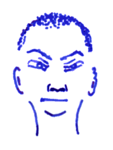

## Darsim

Darsim is a monk of Shira Mountains. Shira is the ice snake, the hunter at the end of the world, a cursed demon of the glaciers. The monks of Shira monastery believe in physical exercise and austere living conditions. If your spirit is weak, you die. If your constitution is weak, you also die. It's a hard life up here.

Darsim's disciples challenge themselves in these cold mountains, and they travel the nine realms, looking for challenges. His stone tower on Shira Mountain is full of acolytes looking to test themselves. There are at least 100 monks that know how to *jump* and use their quarterstaff with deadly accuracy. There are at least 20 elder brothers which know how to use both *fists of airs* and *one thousand fists* at the same time. The 4 guardians of the four wings will have mastered even more techniques, including *focus* and *ground strike*.

### Treasure

The *fan of winds* allows the wearer to catch a wind, from a gust to a full blown typhoon, within the fan, and release it by waving the fan in the correct pattern. Of course, to catch the wind, the fan's wearer has not only to suffer it, but also needs time and space to flawlessly execute the catch pattern. If the fan is destroyed, the winds still imprisoned within will have their revenge on anyone holding the fan.

The fan already contains a few winds:

* A stinking cloud cast by Xerxes, necromancer of the Phidian tower before he was killed.
* Regalion, an elven bard who had used *gaseous form* to break into Darsim's tower in order to steal the fan.
* A calm spring breeze captured when Darsim thought he needed a lull for a ritual but then he forgot about it.
* An angry air elemental captured in Vanaheim.
* Builder of Glass Towers, a Jinni in whirlwind form, also captured in Vanaheim.
* A snowstorm that had come from the Rainbow Snake Glacier last year.
* A cool breeze Darsim uses to cool off when he's stuck where it's hot.

### The Book of the Fist

**Fist of air** (1) enables you to air punch and have those hits travel through the air towards enemies for 10min. You must still roll to hit and you still apply your strength bonus to hit and damage.

**Jump** (1) enables you to leap up into the air and land safely up to 60ft away. You can also hurl yourself at enemies and deal double damage on a melee attack as you come down.

**Shield** (1) gives you AC 3 for 2h as you can deflect blows and missiles using your bare palms.

**One thousand fists** (2) gives you three melee attacks per round for the next 10min.

**Focus** (2) and all your melee attacks next round are an automatic hit dealing maximum damage.

**Protection from cold** (2) protects you from ice storms and natural cold weather for 2h. If you are hit by a cold attack, you automatically take half damage. If a save grants you half damage, you only a quarter damage.

**Ground strike** (3) is a strike with your fist at the ground. A blast of air deals 3d8 damage to anybody within 20ft and they must save vs. explosions or be hurled away, clearing the blast area. They fall prone where they land and until they get up, all melee attacks against them get +4 to hit.

**Cancellation** (3) is a sign you flash with your fingers and a powerful hum that ends all spells and suppresses all magic for a round.

**Paralysing punch** (3) is a strike with your flat hand which paralyzes the victim for a minute. You must still roll to hit. No save.

**Shatter** (4) is shout of such terrible power that it breaks walls up to a feet thick and smash all wooden structures within 10ft, and when shouting at somebody in particular, the target must save vs. death or die.

**Binding touch** (4) charges your palms with contact power so that anybody you touch this round is bound to your hands the next round. Any damage you deal the next round applies to all the victims your touched this round. When running into a dense army formation, you will surely be able to touch two dozen people in a round.

**Slow time** (4) allows you to act four times while time around you slows to a crawl. Spells cast into slow time and attacks made in slow time take effect as time speeds up again.

**Fist of death** (5) is a strike with your fist which immediately kills the victim. You must still roll to hit. No save.

**Mastery of the nine realms** (5) transports you and anybody meditating with you for 10min to any of the eight known realms: Asgard (city of the gods), Alfheim (elves), Midgard (humans), Myrkheim (dwarves), Jötunheim (giants), Vanaheim (demons), Niflheim (trolls), Muspelheim (salamanders). Nobody knows what the ninth ream should be. Perhaps it's the space between the realms, the astral sea, or the world tree, Yggdrasil. You appear near a big and famous structures when you move to a new realm. When you return to a realm you have been to, you appear where you last left it.
