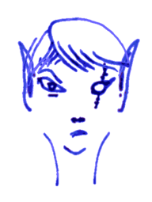

## Fiala

Fiala is a dragon hunter, a killer and a hater. She hates the passage
of time, human settlements, monsters, idleness.

These days she hunts Agrylax the Black, a dragon haunting the Bisarch
Forest and the High Fens, together with her band of brothers and
sisters, a war band of twelve followers just as disciplined, taciturn
and dour. Their names are Aja, Alca, Aneta, Bohdan, Gita, Hana, Hela,
Leksa, Rada, Sava, Venda, Zita. Of these, Aja, Gita and Hela are her
closest and most loyal friends from the old days.

Fiala is a full blown *lunar knight*. Like the elf lords and ladies of
old, she can manifest lunar fury by casting her most powerful spells
and turn into a supernatural death machine. She rarely does this, of
course. But the power is there, and everybody knows it.

### Treasure

The *nemesis compass* is attuned to a foe by rubbing the ground up
hair, scales, skin flakes or some blood into its surface. While the
creature this belonged to is alive, the compass will point towards it
and will refuse attunement to anything else.

### The Book of Dragons

**Light foot** (1) allows you to walk for 4h without leaving any tracks. You will not sink into snow nor disturb any leaves. The gras does not feel your touch and the branches will not snap. You can surprise your opponents on 1–3 in 6.

**Sleep** (1) puts 2d8 HD of creatures to sleep. It works on friend and foe alike, so it cannot safely be used against foes in melee. Lower hit dice and lower hit points are affected first. No save. Creatures with more than four hit dice are immune.

**Water walking** (1) enables a target to walk on liquids for 20min. Usually, this means water, but it might also be lava or quicksand. This spell does not protect against the heat or noxious fumes.

**Far Seeing** (2) creates a floating eye in your palm which you can send anywhere you like. Anything it sees, you see. It travels 60ft per round and lasts for 10min. It can see in the dark if you can see in the dark.

**Flaming sword** (2) turns a regular sword into into a flaming sword dealing an extra 1d6 fire damage. After 20min, the sword loses its magical fire.

**Invisibility** (2) allows you to turn invisible until you attack a living creature. The spell can be reversed: an *invisibility purge* dispels all invisibilities within 60ft. Ethereal creatures or people shadow walking are not affected. The purge lingers for 10 minutes.

**Haste** (3) enables a target to move twice as far, attack twice as often, cast twice as many spells per round, for 10min.

**Breathing** (3) allows one target to breathe poisonous air for one day without suffering any adverse effects.

**Flaming arrows** (3) enchants a quiver or barrel containing up to 50 arrows such that an arrow drawn from this container will be burning with a golden fire dealing an extra 1d6 fire damage. After 20min, all remaining arrows lose their magical fire.

**Blade storm** (4) will summon a magic blade for every level (minimum 7) from your palms and shoot it at a target up to 60ft away. Each blade deals 1d10 damage. You must roll to hit for every blade. No save. The blades will rust away in a few days.

**Earth blow** (4) summons giant piercing steel needles from the Deep Earth, up to 60ft long, able to crush walls, split mountain sides, cause landslides and avalanches. This is the hatred of Earth made manifest.

**Magic shield** (4) protects you for 2h from any spells up to the third circle and thus from all elemental energies such as possessed by dragons: *ice*, *acid*, *lightning*, *fire*. This spell does not protect against poison gas. You can suspend the shield to receive beneficial spells or to cast attack spells yourself, but this opens you to a counter attack until your get to act again.

**Moon blade** (5) summons a shining blade of holy fire (+5 to hit, 2d6+5 damage) lasting for 10min.

**Moon barrier** (5) summons a shining barrier lasting for 10min and protecting you from all magic including elemental damage and all ranged weapons. You can only be damaged in melee. You can still drown and you still die if you fall into lava.
