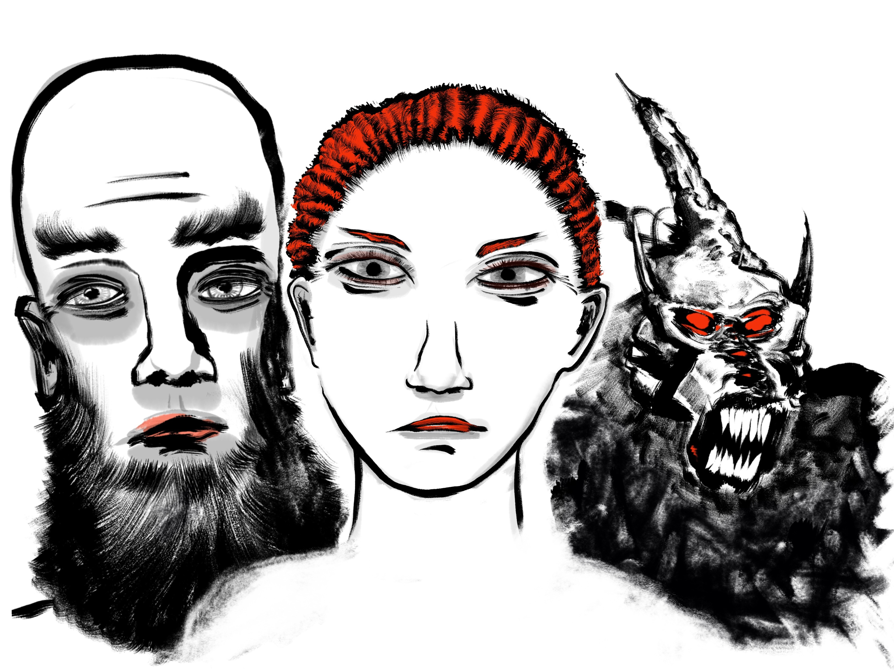

<address>Alex Schroeder</address>

# Halberds & Helmets Spellcasters

## Foreword

In [Halberds &
Helmets](https://alexschroeder.ch/wiki/Halberds_and_Helmets), magic
users and elves need to learn new spells from other spellcasters. This
book lists a few of them to act as quest givers and teachers for
player characters.

All the magic users and elves in this booklet are level ten. This
means that the repertoire of these spellcasters is always the same:
two spells of the fifth circle and three spells of every other circle
that.

The magic users have 10d4 hit points and wear no armour (AC 9), elves
have 10d6 hit points and wear fancy elven plate armour and a shield
when outside their homes (AC 2).

As for the spells themselves, it is unavoidable that some classic
spells are repeated. I hope you don't mind. If you have better ideas,
submit them! My email address:
[kensanata@gmail.com](mailto:kensanata@gmail.com).

If there are similar spells, then it is up to the players to decide
which variants their characters consider worth learning and which
magic users or elves to befriend.

As for the general classification, this is my rule of thumb:

* if a spell has a quantifiable effect in the 1d6 range, it's a spell
  of the first circle

* many utility spells such as *invisibility* are spells of the second
  circle

* dealing damage in the 1d6 per caster level range is a spell of the
  third circle

* *save or die* effects are spells of the fourth circle

* *shape changing* is also of the fourth circle but if there are
  limits on it (a single shape only, or only flying), then the spell
  is of the third circle
  
* long range transportation like *shadow walking* are spells of the
  fourth circle

* creating pocket dimensions and the like are spells of the fifth
  circle.

## License

This work is licensed under the Creative Commons Attribution
ShareAlike 4.0 International License (CC BY-SA 4.0). To view a copy of
this license, visit
[https://creativecommons.org/licenses/by-sa/4.0/](https://creativecommons.org/licenses/by-sa/4.0/).
What follows is a human-readable summary of (and not a substitute for)
the license.

You are free to:

- **Share** — copy and redistribute the material in any medium or format

- **Adapt** — remix, transform, and build upon the material for any
  purpose, even commercially.

The licensor cannot revoke these freedoms as long as you follow the
following license terms:

- **Attribution** — You must give appropriate credit, provide a link
  to the license, and indicate if changes were made. You may do so in
  any reasonable manner, but not in any way that suggests the licensor
  endorses you or your use.

- **ShareAlike** — If you remix, transform, or build upon the
  material, you must distribute your contributions under the same
  license as the original.

- **No additional restrictions** — You may not apply legal terms or
  technological measures that legally restrict others from doing
  anything the license permits.

Notices:

You do not have to comply with the license for elements of the
material in the public domain or where your use is permitted by an
applicable exception or limitation.

No warranties are given. The license may not give you all of the
permissions necessary for your intended use. For example, other rights
such as publicity, privacy, or moral rights may limit how you use the
material.

### Authors

- Alex Schroeder, https://alexschroeder.ch/
- Belchion, https://belchion.rsp-blogs.de/
