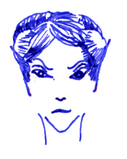

## Gerdana

 Lady Geradana has ruled the coastal elves of
Lagnabadalë for over 250 years. Her elves fish the waters around here
and any other ships in the area eventually run afoul of unexplained
mishaps and disappear.

Lady Gerdana is doted upon by her five true-friends, elves she has
known for two hundred years or more: Achroia, Daria, Honeydew, Luna,
Pyralis (all of them level 9, thus lacking a spell each from 4th and
5th circle). All of these elves like to spend hours and days as a blue
dragon in the palace: AC -1 1d8/1d8/4d8 MV 24. When not *shape
changed* into a dragon, they are all unbelievably beautiful, all their
scars hidden by a powerful *glamour*.

The powerful elves hardly ever speak to visitors. Contact with the
outside world is maintained by Ariana (level 5) who has mastered
*charm person*, *lunar runes*, *glamour*, *true words* and *lightning
bolt*. All other elves in the region has mastered *charm person* or
*sleep*. This includes the two dozen sea elves serving the circle of
true-friends are spellcasters in the palace as well as the sea elves
living in the small town around the harbour below the palace.

The palace itself is illuminated day and night by fantastic glowing
crystals and glass sculptures. It is a shining beacon in itself and
truly the elves here don't ever sleep but drink and dance for hours
upon end. If you cannot sing and dance, cannot play an instrument,
have not made your own arms and armour, cannot speak in rhyme and
meter, or have not read the classics, then you are such a country
pumpkin in the eyes of these elves that even letting them near the
others of their kind would be an offence against taste and manners.

You should know your place.

### The Book of the Sea

**Charm person** (1) affects a single target, save vs. spells to
resist. To break free, victims save again every day if their
intelligence is 13 or better, every week if their intelligence is
average, or every month if their intelligence is 8 or lower. While
charmed, victims will treat you as their best friend. Once victims
break free, they will remember everything they did and if they did
anything they would not have ordinarily have done, they will react
with shame and anger. Charms usually cause severe emotional distress!

**Lunar Runes** (1) allows you to read and write the ancient elven
runes powered by lunar magic for 20min. These runes are usually
invisible or hidden within ornaments and other writing. This spell
makes the lunar runes glow in a pale light, visible to all.

**Sleep** (1) puts 2d8 HD of creatures to sleep. It works on friend
and foe alike, so it cannot safely be used against foes in melee.
Lower hit dice and lower hit points are affected first. No save.
Creatures with more than four hit dice are immune.

**True Words** (2) allows you to look into the eyes of people and read
their feelings, see their imaginations, and hear their thoughts unless
they save vs. spells. These secrets are revealed to you across all
language barriers. In order to learn something specific, the target
must also think about it. How you make them do it is up to you. The
target will know that you are there inside their head.

**Eternal Starlight** (2) can be cast on anything within 60ft; if you
target anything with eyes, it must save vs. spells or be blinded (-4
to hit, no targeting of spells).

**Glamour** (2) is an illusion improving your looks in all respects,
for a day: you look young and beautiful, your scars are gone, you
smell of flowers, your voice is smooth and soothing. Like all
illusions, anybody touching you may save vs. spells in order to see
through it.

**Lightning Bolt** (3) strikes any visible foe within 200ft and
everybody standing between you and them, unless they're very small or
lying on the ground. Anything within two feet of the bolt will be
affected and take 1d6 damage per caster level (5d6 minimum), save
vs. spells for half damage.

**Water breathing** (3) allows one target to breathe underwater for
one day. While breathing underwater, you can speak the languages of
all marine creatures.

**Wind barrier** (3) prevents any flying thing from reaching you for
20min. Arrows, sling stones, rocks flung by giants, projectiles shot
by siege weapons, all will be deflected.

**Decay** (4) is a curse that affects anything built by mortals:
walls, buildings, ships, heirlooms. It doesn't matter. With a touch,
you can speed up its decay by many magnitudes. Within minutes, it is
visibly old and frail, after an hour or two parts are failing and
within a day the structure collapses.

**Flash flood** (4) creates a sudden flood from a body of water within
150 ft. Anybody caught by it must save vs. death or be swept away. If
wearing metal armour, save vs. death again or drown within a minute or
two.

**Shape change** (4) allows you to change your shape. You get all the
physical and none of the mental abilities of your new shape: basically
you get the new looks, the movement, the AC and the natural attacks.
If your new shape can fly, so can you. If it can breath under water,
so can you. If your new shape can't speak, you cannot cast spells. But
if the creature you changed into can breathe fire, you still cannot.
You don't get any magical abilities with the new shape.

**Lunar Sailing** (5) summons a moon caravel. It appears within 10min
and carries up to 20 people. The moon caravel can sail through shallow
waters and on moonlit nights, it can fly up into the air and cross
over into any of the other realms the navigator knows how to find
using their star charts. Each chart names the location and realm it
leads to. These star charts are therefore quite valuable. Sadly,
mastery of this spell does not automatically grant you access to any
star charts.

**Summon Living Storm** (5) conjures an elemental: HD 16 AC -2 3d8 F16
MV 36; plus 1d8 vs. flying creatures; requires a save vs. death to
approach; immune to non-magical weapons; attacks summoner and remains
on this plane if the conjurer's concentration fails. This happens
whenever the caster takes damage. The elemental is usually very hard
to reason with, but it understands simple commands like "sink that
ship" or "kill everybody in this town". The elemental can be dismissed
at any time if it is still under control. When casting this spell for
the first time, a special connection between you and one particular
air elemental is formed. This is the air elemental that answers your
call, every single time, for the rest of your life. Names include
*Flying Debris*, *Blades of Death*, *Pestilence from the Desert*, and
*Ice Storm*.
