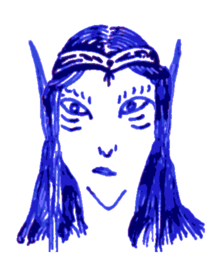

## Hadrael

Hadrael lives in the forest of *Old Treeherder Oak*, where the Nieper
River splits into multiple arms and the ground is wet and dark. There,
away from watchful eyes and surrounded by deathtraps and dragon skulls
this old elf and his shield brothers and sisters live and train, for
they care about nothing other but the slaying of dragons and other
monsters.

They say that if you are fighting evil creatures allied with a dragon,
you might find that Hadrael will come along with you. He cares for
nothing but the dragon, but sometimes that is all you need. Yf the
necromancer reported that when they fought the froglings of the Grey
Swamp, Hadrael killed the green dragon in two rounds. Then again, he
descends from a line of ice hunters and he wears the insignia of
Odin's Wild Hunt.

Hadrael's tree home is a gigantic tree in the swamp, majestic and
somber, and hard to reach by foot because of the magically reinforced
*iron thorn swamp rose thicket* surrounding it for a mile. Visitors
must fly or take the river barge from Iraguk and pray the crocodiles
aren't hungry today.

### The Book of Odin

**Detect magic** (1) makes all magic items within 30ft give of a faint blue glow for 10min. Anybody can see this glow.

**Restore faith** (1) heals 1d6+1 points upon touching the target

**Sleep** (1) puts 2d8 HD of creatures to sleep, no save. The creatures with the least HD go first.

**Speak with animals** (2) allows you to converse will animals of a particular species for 20min. A reaction roll might still be necessary because the animals are not automatically charmed.

**Hold person** (2) paralyses 1d4 human-like creatures for an hour. Human like creatures are not much larger than humans, made of flesh and blood, they have two legs, two arms, a head, and they can speak. Frog men are included, myconids are not; dwarves are included, giants are not.

**Silence** (2) prevents any sound from originating within 15ft of the target (usually a stone, up to 180ft away). Targets may attempt a save vs. spells to avoid the effect. This would prevent them from moving out of range. Nobody can speak or cast spells within 15ft of the target. As outside noise still enters the bubble of silence, victims may not immediately notice that they have been silenced.

**Speed** (3) doubles your actions every round for half an hour: move twice as fast, attack twice as often. You can't cast twice as many spells because timing is important.

**Fly** (3) allows you to fly at your walking speed for 2h.

**Dispel magic** (3) will dispel ongoing spells and suppress magic items for 1d4 rounds.

**Plant growth** (4) turns a 60ft × 60ft area of bushes or trees into a magical thicket in an instant. Machetes or something equivalent will be required to traverse this undergrowth. The spell can also be used to magically enhance larger trees, turning them into majestic towers, able to carry the weight of a large and beautiful tree house, or it can be used to grow trees into magical wooden river barges, or similar wooden structures. When dispelled, the material looses its magical hardiness but doesn't immediately turn to dust. The thorns loose their sting, the wood looses its fire resistance, its imperviousness to salt water.

**Shape change** (4) allows the transformation into a different creature for 2h, such as a dragon. As a dragon, Hadrael's stats change to AC 0 1d8/1d8/3d10 MV 24 (flying).

**Hold monster** (5) paralyses any 1d4 creatures for an hour.
