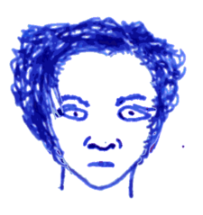

## Jezembal

 The *Golden Dome* is a half submerged church
of the ancient order of the *Golden Snake* people. The dome itself
rises above the waters of *Lake Heaven*. The road up to this crater
lake is decorated with two thousand orange spirit gates. Up here, the
secrets of *Aquamancy* are still being taught by Lady Jezembal and her
disciples, Minetus and Udag.

The crater lake is full of ancient fish dreaming in the deep, cold
waters, waiting for strangers to dive into the waters. There a few
boat at the shore, allowing visitors to row to the *Golden Dome*.
There, they are welcomed by the watch.

### The Book of Aquamancy

The control of water presupposes the existence of enough water in the
vicinity of the caster. The illustrations in the book show water
bearers carrying water into battle using small canteens or larger
waterskins.

**Icicles** (1) will lift a cup of water per level into the air and
turn each one of them into an icicle. Next round, you can shoot them
at designated target within 60ft dealing 1d6 damage each, save
vs. spells for half.

**Ice Wall** (1) pulls water up and freezes it into a thick ice
barrier as big as a castle gate. This barrier has 2d6 hit points per
level and AC 9.

**Wave** (1) moves a body water such that a wave 10ft high forms and
moves in any direction you want. If you can, you may surf on it. If
the wave crashes into land, it deals 2d6 damage to anybody within
20ft. The wave will keep moving as fast as a human can run for as long
as you concentrate.

**Tentacles** (2) pulls water up and turns your two arms into watery
tentacles with water drawn from a nearby source. This gives you two
melee attacks per round for 1d6 damage each. At level 5 these arms can
grow up to 30ft long.

**Frozen path** (2) freezes water in front of you for as long as you
concentrate. If you need to run, save vs. spells to keep the ice
growing fast enough. The frozen path is 10ft wide will melt naturally.
The ice can be broken by attacks dealing 3d6 damage or more. You can
reverse the spell to create a water path through ice.

**Energy** (2) invigorates the beaten and the wounded. Lay your hands
on a victim and restore 2d6+1 hit points.

**Water breathing** (3) allows one target to breathe underwater for
one day.

**Ice storm** (3) lets the winds of the void crash through into our
reality, drawing a line of ice and cold from you towards any target
you point to within 120ft. Anybody caught up in the blast must save
vs. spells and take 3d10 damage or be covered by magic ice. The magic
ice weakens and breaks in 10min if the air is warm enough, or if it is
smashed. If the ice is smashed, the victim takes an extra 3d10 damage
and is surprised, granting a free round of attacks. The magic ice
encases victims, paralysing them, but it also protects them from
further attacks until the ice is smashed or weakens and breaks
eventually. If the air isn't warm enough to melt the magic ice,
encased victims remain frozen until it does, possibly for a *very*
long time.

**Water way** (3) allows you to redirect a flow of water 5ft wide
within 300ft. It will even flow through the air for as long as you
concentrate. Anybody can swim through the air in the floating water.
Even small canoes and the like can travel along these redirected water
ways.

**Flash flood** (4) creates a sudden flood from a body of water within
150 ft. Anybody caught by it must save vs. death or be swept away. If
wearing metal armor, save vs. death again or drown within a minute or
two.

**Part water** (4) allows you to travel through any body of water by
parting the water. No matter how deep the ocean, you can travel along
the sea floor. The partition will hold for as long as you concentrate.
Anybody caught in the water when the partition collapses must save vs.
death or die. If they cannot swim or if they are wearing metal armor,
they must continue saving every round.

**Frozen sleep** (4) allows you to freeze yourself or any target
within 100ft. Inside the ice, your metabolism slows to a crawl,
enabling you to survive centuries, if you want -- or imprisoning your
foes for centuries, if you want. You have a vague idea of your
surroundings while inside the ice and can trigger a thaw when you feel
the time is right. When you die, anybody else you are keeping in a
frozen sleep will thaw.

**Ice bridge** (5) grows a bridge of ice from a patch of snow or ice
you're standing on. The bridge can span up to 100m and is wide enough
for an elephant to cross safely. The surface of the bridge is covered
in snow and not slippery. The bridge collapses after 24h, or if the
caster wills it so.

**Ice castle** (5) creates a small castle of ice from a patch of snow
or ice you're standing on, or expands an existing one. Every day you
may add another building. Every time the castle grows, its power over
the climate in the vicinity grows as well. If you're a long lived elf
with a grudge, eventually the castle grows so large that it's
influence causes another ice age with the entire continent covered in
glaciers.
