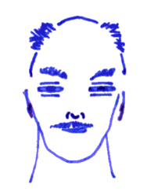

## Korokoro

Ten years ago they found old tunnels of the vat men beneath the
mountains of *Rabish*. Soon, however, the expedition to salvage what
ever had been left behind disappeared and it was said the winds of
madness had eaten what was left. This is the realm of Korokoro, a bird
friend who had opened their mind to the *warp*, that terrible space
between spaces, that gateway to Vanaheim, that realm of Pazuzu.

## The Book of the Warp

**Amnesia** (1) allows you to look somebody in the eyes and lets them
forget what just happened, up to ten minutes. At 5th level, victims
can forget up to a day. This includes all the spells they memorised.
Creatures immune to *charm* or *sleep* spells are also immune to
*amnesia*; anybody else must save vs. spells if they want to look away
in time.

**Recoil** (1) turns you briefly into a horrendous monster in the eyes
of anybody within melee range; anybody who sees you must save
vs. spells or recoil in horror and be *stunned* for one round. To be
stunned means that you cannot move and you cannot attack, but
opponents must still roll to hit. To recoil means to take an
uncontrolled step back. If standing at the edge of an abyss, then so
be it...

**Mishap** (1) is a very small curse on a target within 60ft: they
must save vs. spells or fail their next action, no matter what it is:
all their attacks, all their spells, all their movements. If they
attempt to do it, they fumble. If they try to stab somebody with a
sword, they drop it. If they try to sheathe their sword, they cut
themselves. If they move, they stumble. If they speak, they
mispronounce.

**Ooze** (2) is a very limited shape shift. You can turn to a very
slow moving ooze (MV 3) and flow through the smallest cracks – but
very, very slowly. The effect ends when you will it to end or when you
die. You can pick any colour but you don't gain any special abilities,
cannot speak and cannot damage anybody. Perhaps you can suffocate a
helpless person.

**Outgrowth** (2) allows organic matter to grow from your body: moss,
mushrooms, grass, fur, horns, claws. You can use it to achieve perfect
camouflage if you're immobile, to give off a flowery scent, or to grow
fruit for somebody else to eat. You can command things to grow for ten
minutes and once grown, these things stay until you cut them off
manually. It takes two weeks for last traces to disappear.

**Plague Touch** (2) turns you into a rotting half-corpse for an hour.
Your skin starts peeling off, there's pus and other fluids, the smell
is dreadful, and worst of all: it's contagious. Anybody you touch must
save vs. poison or contract the same rotting disease. You loose half
your hit points and don't regain them when the spell ends. Other
victims you infect loose all their hit points but one within ten
minutes and don't recover unless they undergo a week-long purification
ritual involving a lot of bathing, fuming and changing of bandages.

**Grow limb** (3) makes an extra limb grow out of a body. It takes
about ten minutes to form. For every limb you add beyond the number
your brain was born to deal with, there is a cumulative 1 in 6 chance
of it misbehaving in an emergency: a 2 in 6 chance you cannot take off
with your two new dragon wings, or a 2 in 6 chance you cannot attack
with your two new extra crab pincers. You could avoid the penalty by
amputating your arms, of course. Or you could grow an extra head like
an ettin and have it control the extra limbs. But then you'll need to
make sure it stays loyal.

**Replenish** (3)

**Warp Mind** (3)

**Sharing** (4) allows you to grow a shared understanding with
anything alive within 150ft and to maintain this contact with the area
for a day: to hear what all the plants can hear, to see what all the
animals can see. Intelligent beings in the area must save vs. spells
or share just like everybody else.

**Open Mind** (4)

**Warp Flesh** (4)

**Clone** (5)

**Warp Gate** (5)
