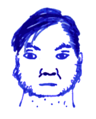

## Lem

Lem is an initiate of the boneless school. He lives beneath a ruined
temple of *Orcus*, the demon lord of the undead. He's not very
interested in temples and neither are his 28 disciples. The first rite
of passage for students and anybody else wanting to meet him is to
whisper words of damnation in a cavern deep underground, reachable
only through tiny passages no wider than a hand's breadth. It is said
that your words will be heard in this pit of despair and a great worm
shall carry you into the deepness where he resides.

The library of Lem contains many works on the squid people, the space
between the realms, the nature of time and space as well as the hidden
symmetries of our reality. At the centre of this retreat is the Golden
Pool, a pool of pure Earth Blood, tamed and clean, safe for the wary.
The life-giving fragrance fills the many rooms down here. Everybody is
quite aware of its mutagenic effect and avoids touching it at all
cost.

**Boneless** (1) allows you to bend your body into impossible shapes
for 20min. You can move as if you didn't have any solid bones in your
body such that you can squeeze through holes the size of a ring if
you're not wearing a thing. Sadly, the things you wear remain as solid
as ever.

**Camouflage** (1) allows you to change colours for 1h. Anything you
carry changes colour with you. As long as you're not moving, there's a
1–5 in 6 chance that people cannot spot you. People that have spotted
you cannot be fooled again.

**Ink** (1) turns the air you exhale charcoal black for 20min. Anybody
within it is blind (-4 to hit). The blackness quickly spreads 15ft in
every direction. A gust of wind disperses it.

**Detachment** (2) allows you to detach pieces of your body, and
reattach them, as long as they haven't been separated from your body
for more than 20min. This includes hands, eyes, and ears. You can
still control detached pieces and you still see and hear and feel what
they do. If you fail to reattach detached pieces, they wither and die
and don't not regenerate.

**Extra arms** (2) grows up to four tentacles for 20min. They act
semi-autonomously, grabbing things within their reach, letting go if
you move on, pulling them closer if you stand still. This is perfect
for climbing rocks and trees, carrying things, and other simple tasks
where you need to get a grip.

**Worm summoning** (2) grants you ability to summon a giant worm in
10min (30ft long, HD 6 AC 3 1d8 F3 MV 60 ML 9 XP 600; swallows victims
on an attack roll of 19 or 20, swim through earth). The worm stays for
2h and can travel up to 20 miles in flat terrain; it carries up to
five people. It can also dig a tunnel 2 miles long using it's Earth
Blood magic, but the tunnel closes again after a bit such that only 10
people may safely follow it below ground.

**Bend space** (3) within 20ft for 10min: take steps 20ft longer,
extend the reach of your arms by 20ft, grow the neck of a giraffe or
the tongue of a frog. To the people around you, it seems as if your
limbs are extremely elongated and thin and that your movements are
quick and blurry but you don't feel weakened by this.

**Extra hands** (3) grows six more human arms for 20min (up to eight
arms). These arms are under your control and each can wield a weapon
as well as you do.

**Regrow** (3) regrows lost limbs. All limbs look like dark tentacles
of the appropriate size, however. This automatically closes all wounds
and stops all bleeding. The tentacles have a bit of autonomy and
cannot be commanded to hold completely still. They are always
exploring, grasping, holding on to things and picking up things. These
tentacles can wield anything a human hand can wield.

**No brainer** (4) grows four facial tentacles for 20min. On your next
melee hit of creature with a skull no larger than a human, you deal no
damage but grapple with your arms and facial tentacles. On every
subsequent hit, your victim must save vs. death or have their brains
destroyed by tentacles forcing their way through nostrils and eye
sockets.

**Madness** (4) turns the world inside out: up to 60ft in every
direction is transmogrified in the most terrible way possible. What is
solid is now soft; what was meek is now terrifying; what was
intelligible is now gibberish; the silence turns to thunder; the light
turns to darkness. These changes are not symmetrical. Cluelessness
does not turn to cleverness. Lead does not turn to gold. Usually this
prevents both speaking and fighting but does allow anybody prepared
for the chaos to move through the area, maybe grab somebody, pass
through walls, and so on. Determine environmental changes affecting
those around you (1d6): 1. acid rain deals 1d6 per round and dissolves
organic material; 2. vampire anemones deal 1d6 per 10ft moved; 3.
flying glass splinters blind unprotected eyes and deal 1d6 per
round; 4. the floor turns into a tar pit, save vs. death unless flying
and start sinking, suffocate in 1d6 rounds unless somebody unaffected
aids you; 5. winds of madness make it impossible to hold onto anything
that isn't securely fastened, anything flying not held fast is ripped
into the space between the realms; 6. flesh melts, skin peels,
intestines balloon, teeth crumble, hair falls, time and death are one
and deal 1d6 per round (this damage cannot be healed, it returns at
the rate of 1hp/night).

**Mind meld** (4) allows you to bond with another being. If they are
unwilling, they are granted a save vs. death. If you succeed, the two
of you share a bond that goes deep: feelings, visions, individual
words. The bond is permanent until you replace it by another. Spells
that affect just you may affect the other person instead, if you so
wish. Distance does not affect this bond.

**Time stop** (5) freezes everything into place. Your arms are still
free to act for as long as you like. Combine with *bend space* and
*extra hands* for maximum effect. Spell effects cannot leave your
presence and all go off around your head when the spell ends.

**Transfer** (5) allows you to exchange minds with a creature you
are holding in your arms. Your brains must be similar enough for this
to work. This is most likely limited to other humanoids of your
approximate size. This effect is permanent.
