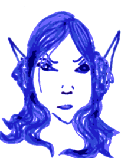

## Taurnalin

Taurnalin is one of the elves with that special connection to the
World Tree, *Yggdrasil*. She has travelled from its roots to its
furthest branches, she has seen the Earth Dragon *Níðhöggr*, she has
seen the nine realms and she decided to live on the World Tree itself.
Find *The Horseshoe Woodhead*, the inn of seven treants. There, take
the trail to the *Shadow Web* where *Ilfang* the eight legged queen
mother rules and climb the gold stairs to reach the *Singing Woods*
where Taurnalin has built her tower above the *Cold Honey* spring. An
undine called *Patience* lives in this spring, the four dryads
*Patience*, *Sadness*, *Love* and *Jealousy* watch over the area, and
the oak treant *Three Hands of Caution* guards the entrance. There are
always twelve elven students in the tower with Taurnalin.

### The Book of Trees

**Magic Bow and Arrows** summones a magic bow +1 and a quiver with 20
arrows. These last until all the arrows have been shot, the bow is
released, or 20min have passed. The bow cannot be passed to anybody
else.

**...** (1)

**...** (1)

**...** (2)

**...** (2)

**...** (2)

**...** (3)

**...** (3)

**...** (3)

**...** (4)

**...** (4)

**...** (4)

**...** (5)

**...** (5)
