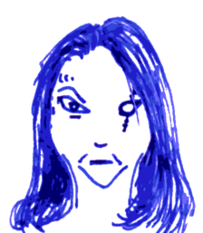

## Ufala

Ufala spent decades studying the bears of Midgard and the bear
soldiers of Jotunheim, and learned many spells from their elders.
They say this is where she lost her eye.

Bears do not like company, and neither does Ufala. And yet, her ten
most loyal companions are the ten seiðr sisters and brothers (3rd
level elves), masters of *bear strength*, *shadows*, and *bear shape*.
Together they live near the great glaciers, collecting berries and
honey in summer, hunting the reindeer and elk; and spending winter in
their *long sleep*.

Ufala and her seiðr sisters and brothers have killed various great
wizards and regents over the last few decades. And truly, who can stop
these shadow walking, shape changing bears? Whenever soldiers have
tried to hunt them down, they escape to places dark and cold where
none may follow.

### The Book of Ursomancy

**Bear strength** (1) grants a target strength 13 (+1) for 1h. At 5th
level, this increases to strength 16 (+3). At 9th level, this
increases to 18 (+3). If the target is already that strong, nothing is
gained.

**Long sleep** (1) sends one target within 30ft into magical slumber.
Unwilling targets must save vs. spells or succumb. This is a light
sleep, so any subsequent noise wakes the sleeper. You may specify when
the target wakes. Either way, the spell ends after a year and a day.
At 5th level, the spell no longer ends on its own. At 9th level, the
spell affects the area 60ft around the target as well, with the
exception of the caster, if so desired. Anybody entering the area must
save vs. spells or succumb. Once asleep, victims do not age, do not
hunger, do not thirst, but rest and heal as well as they can.

**Shadows** (1) reinforces the terrors of the night. When the sun has
set or underground, all shadows deepen, all light grows dim, the grows
cold and fear begins to spread. Units within 60ft must make a morale
check or retreat. Individuals must save vs. spells or stay put,
fearful of attracting the attention of whatever lurks in the darkness.
The sound of combat dispels the effect. Otherwise it holds for as long
as you concentrate on it. Your concentration holds as long as you
don't attack, cast a spell, or take damage.

**Bear shape** (2) turns you into a bear with big hairy arms, long
claws and a terrible jaw with big teeth. Deal damage like a bear:
1d6/1d6/2d6. If both claws hit, a *bear hug* deals an extra 2d8
damage. Your attack, armour class and hit points do not change. Your
strength bonus remains as is, including *bear strength*, if any.
Clothes and armour worn automatically warps and bends with you and
still fits perfectly. The spell lasts for 20min.

**Permanent starlight** (2) catches the surrounding light and
liquefies it, and then it freezes the liquid light into a crystal
which continues to shine for a hundred years.

**Shadow step** (2) allows you to step into the featureless shadow
realm and move up to 30ft. This allows you to pass through walls,
doors, ceilings and across chasms.

**Laser eyes** (3) grants your eyes the ability to shoot laser beams
for 20min: one target per round must save vs. rays or take 1d6 damage.
You can still act normally in addition to using your laser eyes.

**Breath of cold** (3) creates a cone of cold up to 60ft long dealing
1d6 per caster level, save vs. spells for half. It also extinguishes
all fires and freezes all water surfaces.

**Javelins of lightning** (3) turns ten javelins into *javelins of
lightning*. When thrown, these javelins are enveloped in chains of
lightning and when they hit their target, they deal an additional 3d6
of damage, discharging the lightning. When left unused, the energy
dissipates after 20min.

**Summon ursine soldier** (4) summons an unwilling armoured polar bear
to join a fight: HD 6 AC 5 1d6/1d6/2d6 MV 9; an extra 2d8 if both
claws hit.

**Spell warp** (4) disrupts magic around you. For up to 10min and as
far as 60ft, reality is visibly changed: spiders crawl from their
hiding places, mushrooms grow, snakes hiss, roots writhe, leaves curl,
buildings groan, flowers bloom and die, spells cast fails
spectacularly, magic effects are diminished, magic items screech and
howl, all benefits are lost for the duration of the warp.

**Shadow passage** (4) lets you travel through the shadow lands and
take ten companions with you. You can safely travel this way up to one
hundred miles during the night or while you are underground. For every
extra hundred miles everybody on this trip must save vs. death or be
lost in the shadow lands.

**Flying bears** (5) summons a sloth of 1d6+2 confused and angry
flying bears: HD 8 AC 6 1d6/1d6/2d6 MV 12 fly; an extra 2d8 if both
claws hit.

**Ice gate** (5) weakens the veil between your location and Jotunheim,
allowing you to shape a permanent passage. You can expand the dark
space between the two realms, create a maze of black ice or a palace
of glass, whatever you want, just as long as it remains connected at
both ends. Naturally, the influence of snow and ice grow around the
ice gate.
