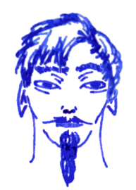

## Versim

To be done.

### The Book of Aeromancy

**Air blast** (1) turns the exhalation of the caster into a blast of
air that extinguishes candles and torches up to 30ft away. Flying
creatures such as harpies or giant bees are automatically pushed up to
30ft away. When used on a surprised opponent, they are automatically
*blinded* for a round (-4 to hit).

**Air surf** (1) allows you to glide for up to 300ft through the air
at 60ft/rd. You cannot gain any altitude. As you glide through the
air, you make no sound as you don't need to move.

**Whisper** (1) sends a short message to any creature you have touched
in the last few weeks only for them to hear and transports back their
short reply, only for you to hear, if given within a few seconds. If
they are asleep, the message wakes them up.

**Guided missile** (2) turns a throwing weapon into a terrible
projectile that tears through the air and unerringly strikes anything
you've aimed it at within 120ft, doing triple damage.

**Scream** (2) fills the air with an unbearable screech that causes
the eyes and ears of mammals to bleed, blinding them for two rounds
(-4 to hit) and prevents speaking and spell casting.

**Wind** (2) calls forth a favourable wind. The wind steadily blows up
to 2h in the direction indicated. This is ideal for sailing ships or
land gliders. Anybody blown away by the wind travels as fast as a
pegasus (the fastest creature known).

**Flatten** (3) causes an air blast to flatten anything around you
within 60ft if it isn't rooted in the earth. Creatures smaller than
humans are thrown through the air, taking 1d6/10ft damage when
crashing down. If they attacked you in melee, they take the full 6d6
damage. Human size creatures are blown off their feet and thrown back,
taking 1d6 damage and granting anybody else still standing a +4 to
their attack. Wooden doors, shuttered windows, glass, porcelain, clay
and any other such structures are shattered.

**...** (3) 

**...** (3)

**...** (4)

**...** (4)

**...** (4)

**Breath of life** (5) grants new, intelligent life to dead matter.
You can grant new life to trees, rocks, corpses, statues, flames,
anything you want. Their life is bound to the body you granted them
but their soul is eternal, just like yours.

**Vacuum** (5) is the spell to end all life. Cast it, and a black
sphere of utter cold spreads around you, growing at 30ft/rd up to
300ft. Inside this sphere, the cold is so absolute the air itself
freezes and falls like snow. This is the cold vacuum of outer space.
Any living thing except for you must save vs. death every single round
or die. You can see up to 10ft inside the sphere. You may move up to
30ft/round and uphold the sphere although it won't grow while you
move, thus the edge never travels faster than 30ft/round. The spell
ends when you decide to no longer uphold it or when you are in danger:
if you take damage or when you roll a saving throw. When the spell
ends, the sphere starts shrinking at 30ft/round until it disappears.
You may cast no other spell while upholding the spell.
